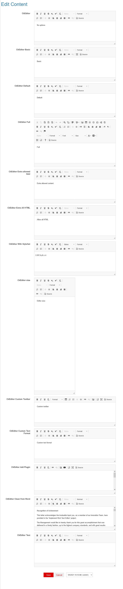

# DNN Open Content CKEditor Configuration Demos

These templates Open Content templates demonstrate the flexibility of the CkEditor in Open Content.
You can select three default configurations or you can specify what icons to load and thus create your own configuration set.

Example:

