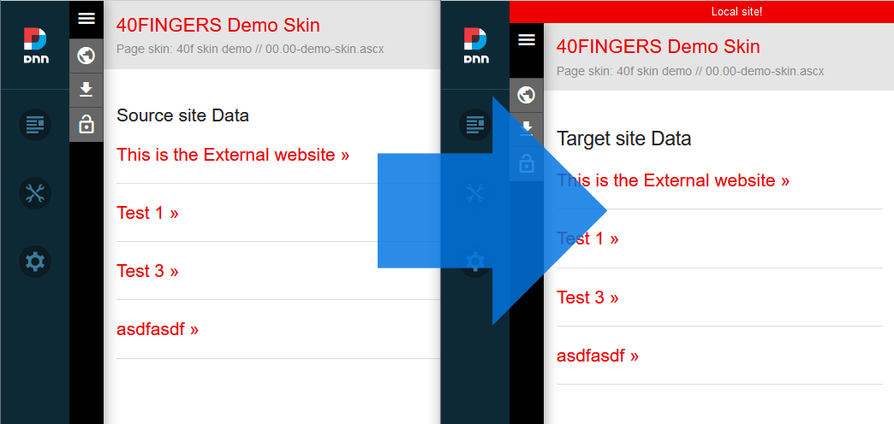

# Load Data from an Open Content Module on another website

This template demonstrates how to load Open Content Data from another website (new in Open Content 5.2.0).
You should first rename the "manifest.json.template" file to manifest.json.

Copy this template on two different websites. 
One site will be the source, the other will be the Target.

On the Source Website you have to go into the Global settings, Click [Generate Rest ApiKey] and copy the generated Key.

The manifest conbtains this block of JSON:

	"disableEdit": true,
	"DataSource": "Satrabel.RestApi",
	"DataSourceConfig": {
		"listUrl": "https://[PortalAlias]/API/OpenContent/ExternalApi/GetAllItems?apiKey=[APIKey]&tabId=[SourceTabId]&moduleId=[SourceModuleId]",
		"detailUrl": "https://[PortalAlias]/API/OpenContent/ExternalApi/GetItem?apiKey=[APIKey]&tabId=[SourceTabId]&moduleId=[SourceModuleId]&id={0}",
		"dataUrl": "https://[PortalAlias]/API/opencontent/OpenContent/ExternalApi/GetData?apiKey=[APIKey]&tabId=[SourceTabId]&moduleId=[SourceModuleId]&scope={0}&key={1}"
	},
	
For the Source site you must remove this  for the Target site you have to Edit it.

For the Target site: replace the tokens with the appropriate Values.
	
	[PortalAlias] the PortalAlias of the Source site (note: for child portals use the complete alias).
	[APIKey] the Source Modules Api Key (Generate one in the Global Settings).
	[SourceTabId] The TabId of the page the Source module is on.
	[SourceModuleId] The ModuleId of the Source module.

Now the Target site will load it's content from the Source site.
All ulrs are relative though, which is why we added a template setting for the Source Domain Name.

You should not enter any value for that on the Source site itself, you should however on the Target site, to make sure the relateive urls point to the right website.
(the Settings value is used in the Template).

Example:

