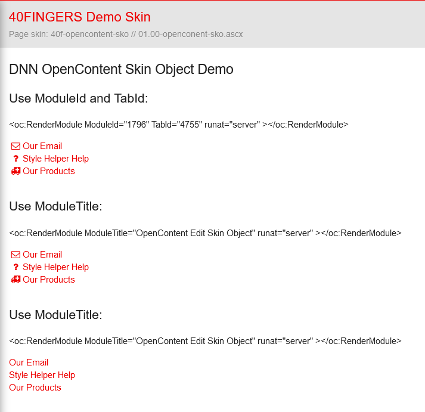

# Open Content Skin / Theme object demo

## Use in DNN Theme / Skin:

~~~
 <%@ Register TagPrefix="oc" TagName="RenderModule" Src="~/DesktopModules/OpenContent/RenderModule.ascx" %>
	
	<oc:RenderModule ModuleId="1796" TabId="4755" runat="server" ></oc:RenderModule>
	
	<oc:RenderModule ModuleTitle="OpenContent Edit Skin Object" runat="server" ></oc:RenderModule>

	<oc:RenderModule ModuleTitle="OpenContent Edit Skin Object" template="/Portals/OpenContent-Demo-Templates/OpenContent/Templates/10.00-OC-Skin-Object/no-icons.hbs" runat="server" ></oc:RenderModule>
~~~

Example:

